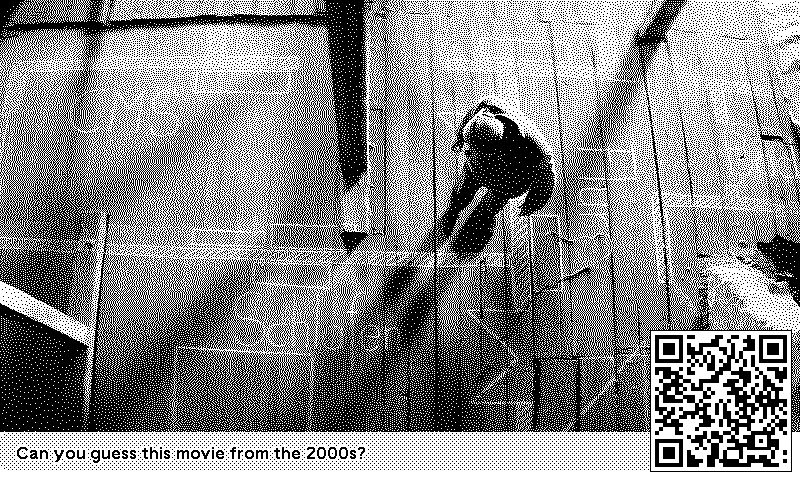

# trmnl-movie-guesser-plugin

<!-- PLUGIN_STATS_START -->
## 🚀 TRMNL Plugin(s)

*Last updated: 2025-11-15 06:21:53 UTC*

##  [Movie Guesser](https://usetrmnl.com/recipes/178211)

### Description
Movie Guesser - Test your film knowledge!   This plugin displays random movie images from 2000 top-rated films. Challenge yourself to identify movies from a single frame.   <b>Features:</b>  ● Random backdrops from critically acclaimed films  ● Customizable filters for genre, year, and popularity  ● QR code reveals movie via TMDB link 
<b>How it works:</b>  Each refresh shows a new random still from your filtered movie selection. Scan the QR code to reveal the answer and see full movie details.   Powered by <a href=https://www.themoviedb.org/>TheMovieDB</a>

### 📊 Statistics

| Metric | Value |
|--------|-------|
| Installs | 1 |
| Forks | 7 |

---

<!-- PLUGIN_STATS_END -->
